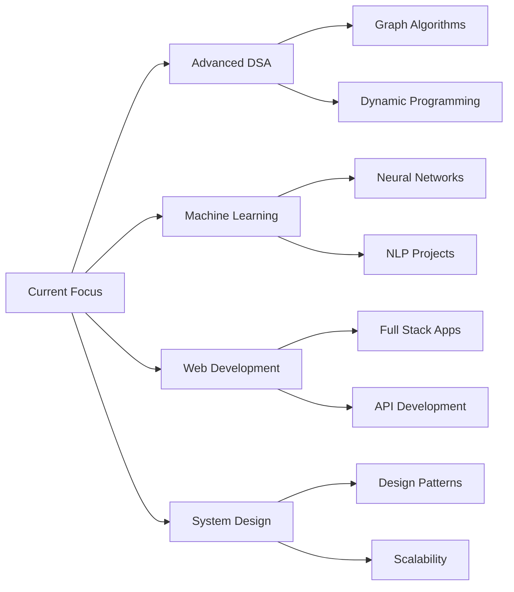

# 💫 Kosar Mahboob's GitHub Profile

<div align="center">
  
  <h1>Hi there! I'm Kosar Mahboob 👋</h1>
  
  <p>
    💻 **Full Stack Developer** • 🧠 **DSA & OOP Expert** • 🤖 **AI Enthusiast**<br>
    🎓 **Computer Science Student** | 🔥 **LeetCode Daily Streak: 60+ Days**
  </p>
  
  
  
  
  
  
  <p>
    <a href="https://www.linkedin.com/in/kosarmahboob">LinkedIn</a> •
    <a href="mailto:kosarmahboob9@gmail.com">Email</a> •
    <a href="https://leetcode.com/u/kosarmahboob/">LeetCode</a> •
    <a href="https://github.com/kosar-mahboob?tab=repositories">All Projects</a>
  </p>

</div>

---

## 🚀 About Me

I'm a passionate Computer Science student specializing in Data Structures, Algorithms, and Full-Stack Development. My journey combines rigorous problem-solving (LeetCode 60+ day streak) with practical project building. I'm currently exploring AI/ML while mastering system design principles.

```python
class Developer:
    def __init__(self):
        self.name = "Kosar Mahboob"
        self.role = "Full Stack Developer & AI Student"
        self.expertise = ["Java OOP", "Python", "DSA", "AI/ML", "Web Dev"]
        self.current_goals = ["LeetCode Daily Challenge", "Build Production Apps", "Learn System Design"]
        
    def daily_routine(self):
        return """
        1. ✅ LeetCode Problem (Morning)
        2. 💻 Project Development
        3. 📚 Study New Technology
        4. 🔄 Code Review & Optimization
        """
        
me = Developer()
```

## 🏆 GitHub Highlights

<div align="center">
  
  | Metric | Achievement |
  |--------|-------------|
  | **Total Repositories** | 15+ Projects |
  | **Public Projects** | 10+ Open Source |
  | **Stars Earned** | 13+ Stars |
  | **Daily Commits** | Consistent 60+ Days |
  | **Languages Used** | Java, Python, C++, SQL |

</div>

## 🛠️ Technical Stack

### **Core Languages**


### **Development Tools**


### **Key Skills**


## 📊 GitHub Analytics

<div align="center">
  
  
  
  
  
  
  
  

</div>

## 🎯 Featured Projects

### **🤖 Mini AI Assistant** *(Latest AI Project)*
**Tech Stack:** Python, NLP, Streamlit, Machine Learning

> An intelligent assistant that helps with study organization, content summarization, and productivity enhancement using AI algorithms.

🔗 **[View Repository](https://github.com/kosar-mahboob/Mini-AI_Assistant)** | 📅 **Updated: Last Week**

**Key Features:**
- 📝 **Smart Note Taking** - AI-powered organization
- 🔍 **Content Analysis** - Automatic categorization
- 📊 **Progress Tracking** - Study metrics visualization
- 🎯 **Task Prioritization** - Intelligent scheduling

---

### **📚 Study Assistant Programming** *(3rd Semester AI Project)*
**Tech Stack:** Python, Educational Technology, AI Algorithms

> Comprehensive study assistant for programming students featuring code analysis, debugging help, and learning path recommendations.

🔗 **[View Repository](https://github.com/kosar-mahboob/Study-Assistant-Programming-For-AI-Project-3rd-SEM-Project)**

**Highlights:**
- 💡 **Code Explanation Generator**
- 🐞 **Debugging Assistant**
- 📈 **Learning Progress Tracker**
- 🛣️ **Personalized Study Paths**

---

### **🎓 Student Record Management System** *(DSA Project)*
**Tech Stack:** Java, Data Structures, File Handling, OOP Principles

> Robust console application demonstrating advanced DSA concepts with efficient CRUD operations and data management.

🔗 **[View Repository](https://github.com/kosar-mahboob/Student-Record-Managment-System_DSA-project)**

**Data Structures Implemented:**
- ⚡ **HashMaps** for O(1) student lookup
- 📚 **ArrayLists** for dynamic record management
- 🔄 **Sorting Algorithms** (QuickSort, MergeSort)
- 🔍 **Search Algorithms** (Binary Search, Linear Search)
- 💾 **Serialization** for data persistence

**Features:**
- 👥 **Multi-User Management**
- 📋 **Attendance Tracking**
- 🏆 **GPA Calculation & Analysis**
- 📊 **Report Generation**
- 🔐 **Data Security Features**

---

### **📈 CGPA Calculator** *(Academic Tool)*
**Tech Stack:** Java, Swing GUI, Mathematical Calculations

> Professional GPA/CGPA calculator with semester-wise tracking, grade predictions, and academic planning features.

🔗 **[View Repository](https://github.com/kosar-mahboob/CGPA-Calculator)**

**Functionality:**
- 📅 **Semester-wise Calculation**
- 📈 **Grade Trend Analysis**
- 🎯 **Target GPA Planning**
- 💾 **Save/Load Transcripts**
- 🖨️ **Report Export**

---

### **🛒 Smart Shop Management System** *(Database Project)*
**Tech Stack:** Java, MySQL, JDBC, Inventory Management

> Complete retail management system with inventory control, sales tracking, customer management, and billing system.

🔗 **[View Repository](https://github.com/kosar-mahboob/SmartShopMangment)**

**Modules:**
- 📦 **Inventory Management** (Stock alert, Reorder points)
- 💰 **Sales & Billing System**
- 👥 **Customer Relationship Management**
- 📊 **Sales Analytics Dashboard**
- 🏪 **Multi-Store Support**

---

### **❓ Quiz Application** *(Interactive Learning)*
**Tech Stack:** Python, Interactive Console, Educational Tools

> Dynamic quiz platform with multiple question types, scoring system, and performance analytics.

🔗 **[View Repository](https://github.com/kosar-mahboob/QuizApp.py)**

**Features:**
- 🎯 **Multiple Question Types** (MCQ, True/False, Fill blanks)
- ⏱️ **Timed Quizzes**
- 📈 **Performance Analytics**
- 📚 **Topic-wise Quizzes**
- 💾 **Score History**

---

### **🔐 Java Login & Signup System** *(First GUI Project)*
**Tech Stack:** Java, Swing, HashMap, User Authentication

> My first Java GUI project featuring secure user authentication with password encryption and session management.

🔗 **[View Repository](https://github.com/kosar-mahboob/java-LoginSignup-Form)**

**Security Features:**
- 🔒 **Password Hashing**
- 📝 **Input Validation**
- 👤 **Session Management**
- 🎨 **User-friendly Interface**
- 💾 **Persistent User Data**

---

### **🎮 Tic Tac Toe Game** *(AI Implementation)*
**Tech Stack:** Python, Game Theory, Minimax Algorithm

> Intelligent Tic Tac Toe game implementing Minimax algorithm with different difficulty levels and unbeatable AI.

🔗 **[View Repository](https://github.com/kosar-mahboob/Tic-Tac-Toe-Game)**

**AI Features:**
- 🤖 **Minimax Algorithm Implementation**
- 📊 **Difficulty Levels** (Easy, Medium, Hard)
- 🏆 **Win Strategy Detection**
- 🛡️ **Defensive Play Algorithms**
- 📈 **Game Statistics Tracking**

---

### **🌳 Tree Data Structure Implementation** *(DSA Lab)*
**Tech Stack:** Java, Data Structures, Tree Algorithms

> Comprehensive implementation of tree data structures including BST, AVL Tree, and traversal algorithms.

🔗 **Private Repository** | 📅 **Updated: Sep 8, 2025**

**Implementations:**
- 🌲 **Binary Search Tree** (Insert, Delete, Search)
- ⚖️ **AVL Tree** (Auto-balancing)
- 🔄 **Tree Traversals** (Inorder, Preorder, Postorder)
- 📊 **Tree Visualization**
- 🔍 **Tree Operations** (Height, Depth, Diameter)

---

### **📘 DSA Practice Repository** *(Daily Coding)*
**Tech Stack:** Java, Algorithms, Problem Solving

> Daily practice repository tracking my DSA journey with categorized problems and solutions.

🔗 **[View Repository](https://github.com/kosar-mahboob/DSA-practice)**

**Categories:**
- 🔢 **Arrays & Strings**
- 📚 **Linked Lists**
- 🌳 **Trees & Graphs**
- 🔄 **Dynamic Programming**
- 🎯 **LeetCode Solutions**

---

### **🏫 Academic Content Repositories**
- **4th Semester Content** *(Private)* - Current semester materials
- **3rd Semester Content** *(Private)* - Previous semester projects
- **DSA Lab Work** *(Private)* - University lab assignments
- **P4AI Lab Work** *(Private)* - Programming for AI labs

## 📌 Current Focus Areas



## 🚀 What's Next?

### **Upcoming Projects**
1. **🤖 AI-Powered Code Reviewer** - Automated code quality analysis
2. **📱 Expense Tracker App** - Full-stack financial management
3. **🎓 Online Learning Platform** - Interactive course delivery
4. **🤝 Collaborative Coding Tool** - Real-time pair programming

### **Learning Roadmap 2025**
- **Q1:** Master Advanced DSA Patterns
- **Q2:** Build Full-Stack Applications
- **Q3:** Dive Deep into Machine Learning
- **Q4:** Contribute to Open Source Projects

## 📈 Weekly Development Activity

```text
🎯 TARGET: 35 HOURS/WEEK
──────────────────────────────
Java Development    ████████████░░░░    60%
Python Projects     ████████░░░░░░░░    40%
LeetCode Practice   ██████████████░░    80%
Web Development     ████░░░░░░░░░░░░    20%
AI/ML Learning      █████░░░░░░░░░░░    30%
──────────────────────────────
TOTAL: 230 HOURS/MONTH ⚡
```

## 🤝 Collaboration Opportunities

I'm actively looking to collaborate on:

- **🤖 AI/ML Research Projects**
- **💻 Open Source Java/Python Libraries**
- **🎓 Educational Technology Tools**
- **🏆 Competitive Programming Teams**
- **🌐 Full-Stack Web Applications**

## 🏅 Achievements & Milestones

<div align="center">
  
  | Milestone | Status | Date |
  |-----------|--------|------|
  | **LeetCode 60+ Day Streak** | ✅ Active | Present |
  | **15+ GitHub Repositories** | ✅ Completed | Jan 2025 |
  | **First AI Project** | ✅ Completed | Dec 2024 |
  | **DSA Mastery (500+ Problems)** | 🎯 In Progress | Target: Mar 2025 |
  | **Open Source Contribution** | 🔄 Planned | Feb 2025 |

</div>

## 📫 Connect With Me

<div align="center">
  
  [](https://www.linkedin.com/in/kosarmahboob)
  [](https://github.com/kosar-mahboob)
  [](mailto:kosarmahboob9@gmail.com)
  [](https://leetcode.com/u/kosarmahboob/)
  [](https://kosar-mahboob.github.io)

</div>

## 💭 Developer Philosophy

> "Code is not just about making things work—it's about creating elegant solutions that stand the test of time. Every bug is a lesson, every algorithm is a story, and every project is a journey toward mastery."

## 🌟 Support My Work

If you find my projects helpful, consider:

- ⭐ **Starring repositories** you find useful
- 🔄 **Forking projects** to build upon
- 💬 **Providing feedback** and suggestions
- 🤝 **Collaborating** on interesting projects

---

<div align="center">
  
  
  
  <p>🚀 <strong>Always building, always learning.</strong> Let's create something amazing together! 💫</p>
  
  
  
  <p>© 2025 Kosar Mahboob • Updated Daily</p>
  
</div>
