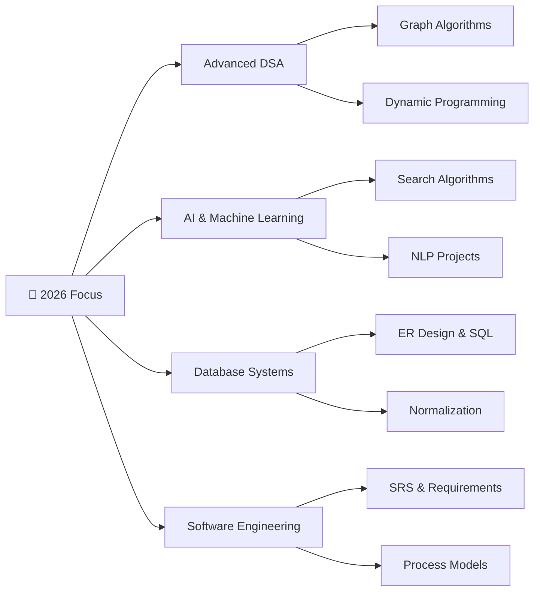

<div align="center">


<br/>


<br/><br/>


<br/>

[](https://www.linkedin.com/in/kosarmahboob)
[](mailto:kosarmahboob9@gmail.com)
[](https://leetcode.com/u/kosarmahboob/)
[](https://kosar-mahboob.github.io)
[](https://github.com/kosar-mahboob?tab=repositories)

</div>

---

## 🧑‍💻 About Me

I'm a passionate **AI program student** at PAF-IAST (Pak-Austria Fachhochschule), currently in my **4th Semester**, diving deep into Software Engineering, Operating Systems, Database Systems, and Artificial Intelligence. I build things that solve real problems — from intelligent assistants to database-driven applications.

```python
class Developer:
    def __init__(self):
        self.name        = "Kosar Mahboob"
        self.university  = "PAF-IAST | School of Computing Sciences"
        self.semester    = "4th Semester — AI Program"
        self.reg_no      = "B24F1055AI025"
        self.role        = "Full Stack Developer & AI Enthusiast"
        self.skills      = ["Java OOP", "Python", "DSA", "AI/ML", "SQL", "Web Dev"]
        self.currently   = ["Software Engineering (CS-204)",
                            "AI Lab (COMP-340L)",
                            "Operating Systems",
                            "Database Systems (COMP-262)"]
        self.streak      = "LeetCode Daily 🔥"

    def daily_routine(self):
        return {
            "Morning"   : "☕ LeetCode Problem of the Day",
            "Afternoon" : "💻 Project Development & Labs",
            "Evening"   : "📚 Study New Tech / Coursework",
            "Night"     : "🔄 Code Review & GitHub Commit",
        }

me = Developer()
print("Always building. Always learning. 🚀")
```

---

## 🏆 GitHub At a Glance

<div align="center">

| Metric | Achievement |
|:------:|:-----------:|
| 📁 **Total Repositories** | 15+ Projects |
| 🌍 **Public Projects** | 10+ Open Source |
| ⭐ **Stars Earned** | 13+ Stars |
| 🔥 **Commit Consistency** | 60+ Day Active Streak |
| 💬 **Languages Used** | Java · Python · C++ · SQL |

</div>

---

## 🛠️ Technical Stack

### 🔤 Core Languages


### ⚙️ Tools & Frameworks


### 🧠 Competencies


---

## 📊 GitHub Analytics

<div align="center">


</div>

---

## 🎯 Featured Projects

### 🤖 Mini AI Assistant *(Latest — 2025)*
**Stack:** `Python` `NLP` `Streamlit` `Machine Learning`

> An intelligent personal assistant for study organization, content summarization, and productivity enhancement using AI algorithms.

🔗 **[View Repository](https://github.com/kosar-mahboob/Mini-AI_Assistant)**

- 📝 Smart Note Taking with AI-powered organization  
- 🔍 Automatic content categorization & analysis  
- 📊 Study progress metrics visualization  
- 🎯 Intelligent task prioritization & scheduling  

---

### 📚 Study Assistant — Programming *(3rd Semester AI Project)*
**Stack:** `Python` `Educational Tech` `AI Algorithms`

> Comprehensive AI-powered study assistant with code analysis, debugging help, and personalized learning path recommendations.

🔗 **[View Repository](https://github.com/kosar-mahboob/Study-Assistant-Programming-For-AI-Project-3rd-SEM-Project)**

- 💡 Code Explanation Generator  
- 🐞 Debugging Assistant  
- 📈 Learning Progress Tracker  
- 🛣️ Personalized Study Paths  

---

### 🎓 Student Record Management System *(DSA Project)*
**Stack:** `Java` `Data Structures` `File Handling` `OOP`

> Robust console application demonstrating advanced DSA concepts with efficient CRUD operations, GPA tracking, and data persistence.

🔗 **[View Repository](https://github.com/kosar-mahboob/Student-Record-Managment-System_DSA-project)**

**DSA Implemented:** HashMaps (O(1) lookup) · ArrayLists · QuickSort / MergeSort · Binary Search · Java Serialization

- 👥 Multi-User Management & Attendance Tracking  
- 🏆 GPA Calculation & Academic Report Generation  
- 🔐 Data Security & Input Validation  

---

### 🛒 Smart Shop Management System *(Database Project)*
**Stack:** `Java` `MySQL` `JDBC` `Inventory Management`

> Complete retail management solution with inventory control, billing, CRM, and sales analytics powered by a relational MySQL backend.

🔗 **[View Repository](https://github.com/kosar-mahboob/SmartShopMangment)**

- 📦 Inventory with stock alerts & reorder points  
- 💰 Full Sales & Billing System  
- 📊 Analytics Dashboard  
- 🏪 Multi-Store Support  

---

### 📈 CGPA Calculator *(Academic Tool)*
**Stack:** `Java` `Swing GUI` `Mathematical Calculations`

🔗 **[View Repository](https://github.com/kosar-mahboob/CGPA-Calculator)**

- 📅 Semester-wise GPA calculation & trend analysis  
- 🎯 Target GPA planning & prediction  
- 💾 Save/Load transcripts + Report Export  

---

### 🎮 Tic Tac Toe — AI *(Game Theory)*
**Stack:** `Python` `Minimax Algorithm` `Game Theory`

🔗 **[View Repository](https://github.com/kosar-mahboob/Tic-Tac-Toe-Game)**

- 🤖 Unbeatable AI via Minimax  
- 📊 Easy / Medium / Hard difficulty levels  
- 🏆 Win strategy detection + game statistics  

---

### ❓ Quiz Application *(Interactive Learning)*
**Stack:** `Python` `Interactive Console`

🔗 **[View Repository](https://github.com/kosar-mahboob/QuizApp.py)**

- 🎯 MCQ · True/False · Fill in the Blanks  
- ⏱️ Timed quizzes with performance analytics  

---

### 🔐 Java Login & Signup System *(First GUI Project)*
**Stack:** `Java` `Swing` `HashMap` `Authentication`

🔗 **[View Repository](https://github.com/kosar-mahboob/java-LoginSignup-Form)**

- 🔒 Password hashing & session management  
- 💾 Persistent user data with input validation  

---

### 🌳 Tree Data Structures *(DSA Lab)*
**Stack:** `Java` · BST · AVL Tree · Traversals

🔗 **Private Repository** | 📅 Updated: Sep 2025

- Binary Search Tree, AVL Auto-balancing, all standard traversals  

---

### 📘 DSA Practice Repository *(Daily Coding)*
**Stack:** `Java` · `LeetCode Solutions`

🔗 **[View Repository](https://github.com/kosar-mahboob/DSA-practice)**

- Arrays · Linked Lists · Trees · Graphs · Dynamic Programming  

---

## 🗺️ Current Focus



---

## 📅 Learning Roadmap — 2026

| Quarter | Goal |
|:-------:|:-----|
| **Q1** | Master Graph Algorithms & complete 4th Semester strong |
| **Q2** | Build full-stack production applications |
| **Q3** | Deep dive into Machine Learning & Neural Networks |
| **Q4** | Contribute to Open Source + internship preparation |

---

## 📈 Weekly Dev Activity

```text
🎯 TARGET: 35 HOURS/WEEK
──────────────────────────────────────
Java Development     ████████████░░░░  60%
Python Projects      ████████░░░░░░░░  40%
LeetCode Practice    ██████████████░░  80%
AI/ML Learning       ██████░░░░░░░░░░  35%
Web & DB Projects    █████░░░░░░░░░░░  25%
──────────────────────────────────────
TOTAL: ~230 HOURS/MONTH ⚡
```

---

## 🏅 Achievements & Milestones

<div align="center">

| Milestone | Status | Date |
|-----------|:------:|:----:|
| 🔥 LeetCode Daily Streak | ✅ Active | 2025 → Present |
| 📁 15+ GitHub Repositories | ✅ Done | Jan 2025 |
| 🤖 First AI Project Shipped | ✅ Done | Dec 2024 |
| 📊 DSA 500+ Problems | 🎯 In Progress | Target: Q2 2026 |
| 🌍 Open Source Contribution | 🔄 Planned | Q2 2026 |
| 🏫 4th Semester Completion | 🎓 In Progress | 2026 |

</div>

---

## 🤝 Open to Collaborate On

- 🤖 AI/ML Research & Projects  
- 💻 Open Source Java / Python Libraries  
- 🎓 EdTech & Student Tools  
- 🏆 Competitive Programming  
- 🌐 Full-Stack Web Applications  

---

## 💭 Philosophy

> *"Code is not just about making things work — it's about crafting elegant solutions that stand the test of time. Every bug is a lesson, every algorithm is a story, every project is a step toward mastery."*

---

## 📫 Let's Connect

<div align="center">

[](https://www.linkedin.com/in/kosarmahboob)
[](https://github.com/kosar-mahboob)
[](mailto:kosarmahboob9@gmail.com)
[](https://leetcode.com/u/kosarmahboob/)
[](https://kosar-mahboob.github.io)

<br/>


<br/>


<sub>© 2026 Kosar Mahboob · PAF-IAST AI Program · Updated Regularly</sub>

</div>
